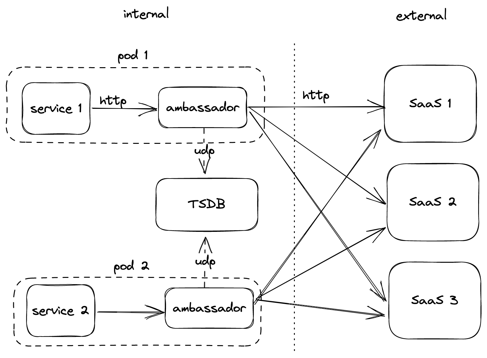

## Problem

> Need to offload cross-cutting client connectivity concerns to infrastructure developers or other more specialized teams.

## Context

A startup company heavily relies on other SaaS APIs to build the business. In other words, latency from out-going API requests make significant impact on user experience. They would like to build a service to monitor all out-going requests to better understand the potential bottlenecks.

## Architecture

1. The monitoring ambassadors are deployed as sidecars. Every service will have one monitoring ambassador container.
2. Interaction flow
   1. The service sends an HTTP request to the ambassador sidecar container.
   2. The ambassador starts counting time consumed and proxies the request to the targeted SaaS API.
   3. The ambassador receives the response from the SaaS API, then sends the time data to the time series database.
   4. Finally, the ambassador proxies back the response to the service.



## Demo setup

- Three fake SaaS api servers.
  - A single API interface: `/hello`.
  - A request consumes 0-2 seconds randomly.
- A main service.
  - Randomly picks a SaaS server to send a request.
  - Infinite loop.
- A time-series database: `InfluxDB`.
- An ambassador container.

## Run the demo

> It's assumed your current working directory is in this folder.

```bash
# influxdb requires an initial setup setp
docker compose create
docker compose start influxdb
docker compose exec influxdb bash /setup_influx.sh
# start all other services
docker compose up
```
