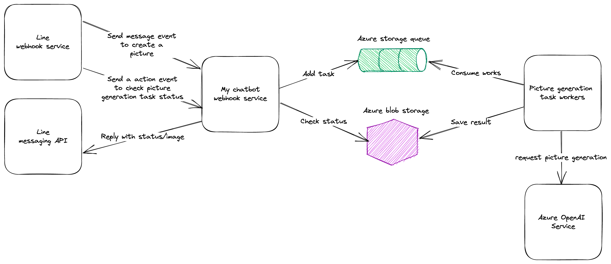

## Problem

> Client-side code, such as browser applications, where it's difficult to provide call-back endpoints, or the use of
> long-running connections adds too much additional complexity.

## Context

While hosting a Line chatbot, Line will send webhook events to the chatbot server, along with a reply token. Line
expects the server to send an HTTP POST request with the given reply token to its API to reply to a certain message.
However, the reply token expires in 30 seconds. If the underlying logic takes longer than 30 seconds, it would be
impossible to reply to the message and the user experience drops significantly.

I'll build a Line chatbot to let me generate pictures via Line. The picture generation functionality is provided by
OpenAI through Azure OpenAI Service. However, the time it requires to generate a picture depends on the complexity of
prompts. In other words, we are at risk of losing contact with users.

## Architecture



## Demo setup

### Prerequisites

- Azure CLI (also logged in)
- Line official account

### Common environment variables setup

```shell
export RESOURCE_GROUP_NAME=brian-async-req-reply-pattern
export RESOURCE_GROUP_LOCATION=japaneast
```

### Create the demo resource group

```shell
az group create -n $RESOURCE_GROUP_NAME --location $RESOURCE_GROUP_LOCATION
```

### Create az container registry and build images

```shell
export ACR_NAME=briancloudpatternpractice
az acr create -n $ACR_NAME -g RESOURCE_GROUP_NAME --sku basic -l $RESOURCE_GROUP_LOCATION --admin-enabled true
az acr build --image webhook:latest --registry briancloudpatternpractice --file Dockerfile --target webhook .
az acr build --image worker:latest --registry briancloudpatternpractice --file Dockerfile --target worker .
# Get login credentials
export ACR_LOGIN_SERVER=$(az acr show -n $ACR_NAME -g $RESOURCE_GROUP_NAME --query loginServer --output tsv)
export ACR_USERNAME=$(az acr credential show -n briancloudpatternpractice -g brian-async-req-reply-pattern --query username --output tsv)
export ACR_PASSWORD=$(az acr credential show -n briancloudpatternpractice -g brian-async-req-reply-pattern --query "passwords[0].value" --output tsv)
```

### Create az storage


### Deploy containers

webhook

```shell

```

worker

```shell
az containerapp create \
  -n worker -g "$RESOURCE_GROUP_NAME" \
  --environment "brian-async-req-reply-pattern" \
  --secrets "openai-key=$OPENAI_API_KEY" "storage-account-connection-string=$AZ_STORAGE_ACCOUNT_CONNECTION_STRING" \
  --registry-server "$ACR_LOGIN_SERVER" \
  --registry-username "$ACR_USERNAME" \
  --registry-password "$ACR_PASSWORD" \
  --cpu 0.25 \
  --env-vars "AZ_STORAGE_ACCOUNT_CONNECTION_STRING=secretref:storage-account-connection-string" "OPENAI_API_KEY=secretref:openai-key" \
  --image "$ACR_LOGIN_SERVER/worker:1.0.2" \
  --memory 0.5 \
  --min-replicas 0 \
  --max-replicas 1 \
  --scale-rule-metadata "queueName=picturegeneration" "queueLength=10" \
  --scale-rule-auth "connection=storage-account-connection-string" \
  --scale-rule-name "scale-by-queue-length" \
  --scale-rule-type "azure-queue"
```

### Deploy demo infrastructures

```shell
az deployment group create -g brian-async-req-reply-pattern -f main.bicep
```

## Run the demo

## Demo

