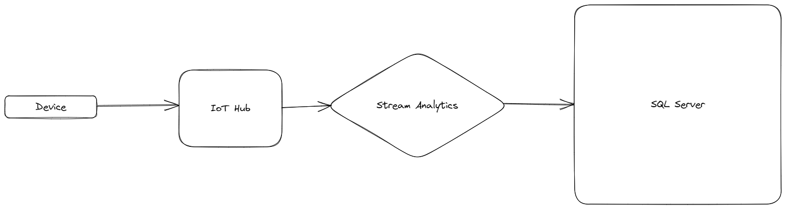

## Problem

> It's a difficult thing to upload data to Cloud from Device.
> So Azure IoT Hub provide a solution to connect device and cloud, also provide UI and some services to let you manage device well. 

## Context

## Architecture

Use endpoint and connection string let data transfer easily.
Also, there are many services can be connected to IoT Hub.
We only focus on device and IoT Hub. 

## Demo setup

## Run the demo

## Demo

